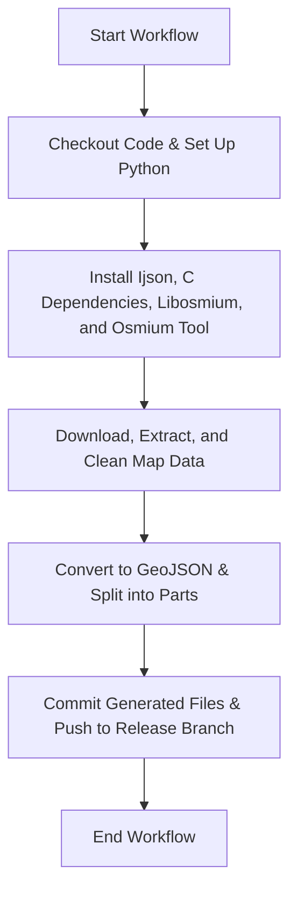

# Bus Map

## Generate GeoJSON

This GitHub Actions workflow automates the process of generating GeoJSON files from OpenStreetMap (OSM) data and splitting them into parts for more manageable handling.

## Overview

The workflow is triggered either manually (`workflow_dispatch`) or automatically when a push occurs to the `test` branch. It processes OSM data for a specified region (in this case, Taiwan) by performing the following steps:

1. Check out the code repository.
2. Set up the Python environment and install dependencies.
3. Install C dependencies, including `libosmium` and `osmium-tool`.
4. Download the latest OSM data for Taiwan.
5. Extract a specific bounding box from the map data.
6. Clean the extracted map data by removing unnecessary metadata.
7. Convert the cleaned data to GeoJSON format.
8. Split the GeoJSON file into parts using a Python script.
9. Commit and push the split parts to the `release` branch.

