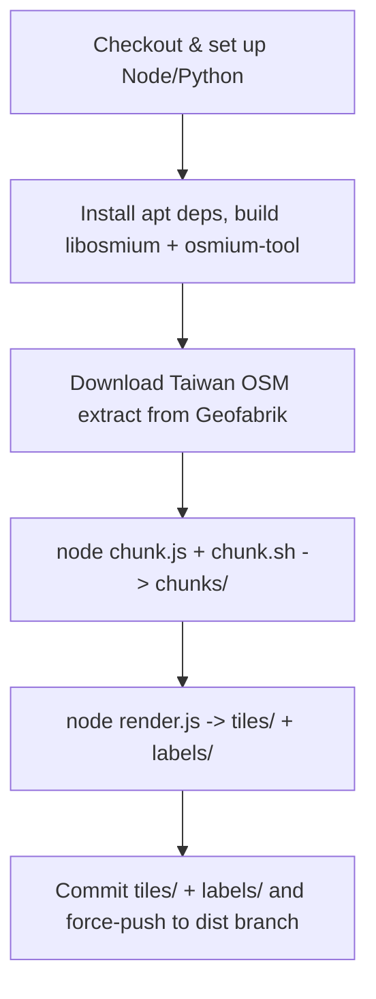

# Bus Map

A from-scratch OpenStreetMap renderer for Taiwan: it turns a raw `.osm.pbf` extract into raster map tiles and label overlays without a PostGIS/Mapnik server, styled with a modified [OpenStreetMap-Carto](openstreetmap-carto-master/) stylesheet, and viewed in the browser with [Bus](https://github.com/EricHsia7/bus).

## How it works

The pipeline replaces the usual PostGIS + Mapnik stack with plain JS/Python scripts that operate directly on OSM tags and CartoCSS rules:

1. **Compile the style** (`style.sh` → `compile-carto.js`) — concatenates `style/*.mss` into `style.mss`, then compiles the CartoCSS/LESS into `style.json`, a flat list of paint rules. `color.js` handle CSS color parsing, and `calc.js` evaluates CartoCSS numeric expressions.
2. **Compile the layer mapping** (`compile-mml.py`) — parses `openstreetmap-carto-master/project.mml`, extracts each layer's Datasource SQL with a real Postgres parser (`sqlglot`), and emits `mml.json`: per-layer conditions and computed columns (e.g. `feature`, `int_surface`). This lets features be classified without ever running the SQL against a database.
3. **Fetch & chunk the data** — the GitHub Actions workflow downloads the latest Taiwan extract from Geofabrik, then `chunk.js` (using tile math in `coordinate.js`) generates `chunk.sh`, a set of `osmium extract` commands that split the extract into per-tile `.osm.pbf` chunks under `chunks/`, per the bounding box/zoom in `config.json`.
4. **Render** (`render.js`) — for each chunk: `infer-layer.js` uses `mml.json` to infer which style layer(s)/feature a raw OSM tag set belongs to, `match-rule.js` matches it against `style.json` to find the applicable paint rule(s), `assemble.js` stitches `multipolygon`/`boundary` relation members into filled rings (so relation-tagged water/landuse/forest areas aren't dropped), and `plot.js` projects geometry into pixel space per tile. `paint-to-svg.js` turns matched paint rules into SVG fills/strokes (background only), which `rasterize.js` (via `@resvg/resvg-js` + `sharp`) rasterizes into WEBP tiles under `tiles/`. `paint-to-label.js` extracts text/marker/shield symbolizers separately into label GeoJSON under `labels/`, so browsers can place labels live instead of baking them into the raster.

## Automation

`.github/workflows/update.yml` runs the full pipeline on push to `test` or manual dispatch:


```mermaid
flowchart TD
    A[Checkout & set up Node/Python] --> B[Install apt deps, build libosmium + osmium-tool]
    B --> C[Download Taiwan OSM extract from Geofabrik]
    C --> D[node chunk.js + chunk.sh -> chunks/]
    D --> E[node render.js -> tiles/ + labels/]
    E --> F[Commit tiles/ + labels/ and force-push to dist branch]
```

Each expensive step (npm deps, the osmium build, the downloaded extract, chunks, tiles/labels) is cached by content hash to speed up repeated runs.

## Configuration (`config.json`)

| Key | Meaning |
| --- | --- |
| `data` | Path to the input `.osm.pbf` |
| `bbox` | `west`/`south`/`east`/`north` bounds of the region to render |
| `chunks.dir`, `chunks.baseZ`, `chunks.output` | Output dir, base zoom for tiling the extract, and generated shell script name |
| `tiles.dir`, `tiles.z.min`/`max` | Output dir and zoom range for rendered tiles |
| `tiles.size`, `tiles.labelQuantization`, `tiles.precision`, `tiles.background` | Raster tile size, label coordinate quantization, geometry precision, and background fill color |

## Supporting files

- `coordinate.js` — lon/lat ↔ tile and pixel-space math shared by chunking, plotting, and rendering.
- `files.js` — small filesystem helpers (e.g. recursive `mkdir`).
- `fileformat.proto` — the OSM PBF `fileformat`/`osmformat` protobuf schema used when decoding chunk data.
- `dependencies.txt` — apt packages required to build `libosmium`/`osmium-tool` (used by CI and for local setup).
- `openstreetmap-carto-master/` — vendored upstream [OpenStreetMap-Carto](https://github.com/gravitystorm/openstreetmap-carto) project; `project.mml` and `style/` are the source of the compiled layer mapping and paint rules.

## Requirements

- Node 24 and the npm dependencies in `package.json` (`@resvg/resvg-js`, `sharp`, `fflate`, `protobufjs`, `postcss`/`postcss-less`, `mapshaper`, etc.)
- Python 3.11 with the packages in `compile-mml.requirements.txt` (`pyyaml`, `sqlglot`)
- `osmium-tool` + `libosmium`, plus the system packages in `dependencies.txt`, to build them from source

## Local usage

```bash
npm install
pip install -r compile-mml.requirements.txt

# 1. Compile the style and layer mapping (only needed after editing style/*.mss or project.mml)
bash style.sh
python3 compile-mml.py openstreetmap-carto-master/project.mml > mml.json

# 2. Provide an input extract and adjust config.json (data path / bbox / zooms) as needed

# 3. Split the extract into per-tile chunks
node chunk.js
chmod +x ./chunk.sh
./chunk.sh

# 4. Render raster tiles and label overlays
node render.js
```
